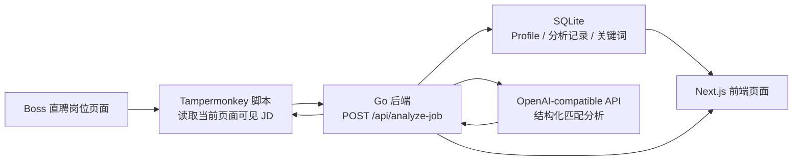

# job-application-ai-assistant

## 1. 项目简介

`job-application-ai-assistant` 是一个岗位匹配分析工具 / AI 求职辅助工具，用于结合个人 Profile 和招聘岗位 JD，分析岗位匹配度、技能缺口、沟通建议和投递记录。

项目基于 Go `net/http`、Next.js、SQLite、Tampermonkey 和 OpenAI-compatible API 构建。它定位为求职辅助分析工具，不是自动投递工具：用户仍然自己登录招聘平台、自己浏览岗位、自己判断是否沟通或投递。

## 2. 项目背景

实习或校招投递时，Boss 直聘等招聘平台上的岗位 JD 数量多、信息密度高，手动判断岗位是否适合自己会消耗大量时间。这个项目希望把重复的 JD 阅读、技能点归纳和投递记录整理工作工具化，帮助用户更快回答几个问题：

- 当前岗位和个人技能、项目经历是否匹配；
- JD 中有哪些关键技术要求，哪些是自己的优势或短板；
- 简历或项目描述可以如何针对性优化；
- 当前岗位是否值得优先投递或进一步沟通；
- 已分析、已投递、已沟通的岗位如何持续记录和追踪。

## 3. 核心功能

- 个人 Profile 管理：维护姓名、目标岗位、技能列表、项目经历和个人简介。
- 当前岗位 JD 分析：从当前 Boss 直聘岗位页面读取可见 JD 文本，发送给本地后端分析。
- 匹配分析结果：输出匹配分、风险等级、匹配点、缺失点和岗位判断依据。
- 简历优化建议：根据 JD 和个人 Profile 给出可用于优化简历描述的建议。
- 沟通语生成：生成面向当前岗位的简短沟通建议，由用户自行复制、修改和发送。
- 投递记录管理：保存岗位分析结果、原始 JD、公司、岗位和分析时间。
- 投递状态修改：支持更新岗位记录状态，例如待投递、已投递、已沟通、面试、拒绝。
- 岗位关键词统计：对已分析 JD 中的技术关键词进行统计和归一化展示。
- Tampermonkey 页面浮层展示：在岗位页面提供分析入口，并展示当前岗位分析结果。

## 4. 技术栈

| 模块 | 技术 |
| --- | --- |
| Backend | Go `net/http` |
| Database | SQLite |
| Frontend | Next.js |
| Browser script | Tampermonkey |
| AI | OpenAI-compatible API |
| Containerization | Docker / Docker Compose |

## 5. 架构说明



本地浏览器中的 Tampermonkey 脚本只负责读取当前页面可见文本，并把岗位信息发送到本地 Go 后端。Go 后端读取 SQLite 中的个人 Profile，调用 OpenAI-compatible API 得到结构化分析结果，再将结果写入 SQLite。Next.js 前端用于管理 Profile、查看投递记录和查看关键词统计。

Docker Compose 下的访问关系：

- `backend` image 由 `backend/Dockerfile` 构建，运行后形成 `job-ai-backend` container；
- `frontend` image 由 `frontend/Dockerfile` 构建，运行后形成 `job-ai-frontend` container；
- `frontend` container 通过 Docker Compose 服务名访问 `http://backend:8083`；
- Windows 浏览器通过 `http://localhost:3000` 访问前端；
- 后端 API 通过 `http://localhost:8083` 暴露到宿主机；
- SQLite 数据库位于后端 container 内的 `/app/data/app.db`，并通过 `job_ai_backend_data` volume 持久化。

## 6. 本地开发启动

默认端口：

- 后端：`8083`
- 前端：`3000`

启动后端：

```powershell
cd backend
go mod tidy

$env:AI_API_KEY = "your_api_key_here"
$env:AI_BASE_URL = "https://api.openai.com/v1"
$env:AI_MODEL = "gpt-4.1-mini"
$env:PORT = "8083"

go run .
```

启动前端：

```powershell
cd frontend
npm install
npm run dev
```

访问前端：

```text
http://localhost:3000
```

健康检查：

```text
http://localhost:8083/api/health
```

## 7. Docker Compose 启动

Docker Compose 会基于 Dockerfile 构建 backend / frontend 两个 image，并启动对应 container。SQLite 数据通过 Docker volume 持久化，停止 container 不会删除数据。

先在仓库根目录创建 `.env`：

```env
AI_API_KEY=your_api_key_here
AI_BASE_URL=https://api.openai.com/v1
AI_MODEL=gpt-4.1-mini
PORT=8083
```

不要提交真实 `.env` 文件，也不要把真实 API Key 写入 README、前端代码或 Tampermonkey 脚本。

启动：

```powershell
docker compose up --build
```

停止：

```powershell
docker compose down
```

不要随便执行下面的命令：

```powershell
docker compose down -v
```

`-v` 会删除 Docker Compose 创建的 volume，包括保存 SQLite 数据库的 `job_ai_backend_data`，这会导致历史 Profile、岗位分析记录和关键词统计数据丢失。

访问地址：

```text
http://localhost:3000
http://localhost:8083/api/health
```

## 8. Tampermonkey 脚本使用方式

脚本路径：

```text
scripts/boss-job-analyzer.user.js
```

安装步骤：

1. 浏览器安装 Tampermonkey 扩展。
2. 打开 Tampermonkey 管理面板。
3. 新建脚本。
4. 删除默认内容。
5. 将 `scripts/boss-job-analyzer.user.js` 的完整内容复制到脚本编辑器并保存。
6. 确认本地后端正在运行，默认地址为 `http://localhost:8083`。
7. 用户自行登录 Boss 直聘并打开具体岗位详情页。
8. 点击页面浮层中的分析按钮，查看当前岗位分析结果。

Tampermonkey 脚本不包含 API Key。脚本只读取当前页面可见文本，并发送给本地后端分析。

## 9. 环境变量

| 变量 | 使用位置 | 说明 |
| --- | --- | --- |
| `AI_API_KEY` | 后端 | OpenAI-compatible API Key，必填，只能放在后端环境变量中。 |
| `AI_BASE_URL` | 后端 | API Base URL，默认可使用 `https://api.openai.com/v1`。 |
| `AI_MODEL` | 后端 | 模型名称，例如 `gpt-4.1-mini`。 |
| `PORT` | 后端 | 后端监听端口，默认 `8083`。 |
| `DB_PATH` | 后端 | SQLite 数据库路径；Docker Compose 中设置为 `/app/data/app.db`。 |
| `BACKEND_URL` | 前端 Docker build / runtime | Next.js rewrite 使用的后端地址；Docker Compose 中设置为 `http://backend:8083`，本地开发默认 `http://localhost:8083`。 |

说明：

- 后端变量只在 Go 服务中使用，API Key 不进入前端 bundle。
- Docker Compose 会自动读取仓库根目录 `.env` 中的变量，并注入到 backend container。
- `BACKEND_URL` 用于 frontend container 访问 Docker Compose 网络内的 backend 服务，不是浏览器访问地址。
- 真实 `.env` 不应提交到仓库。

## 10. API 简要说明

```http
GET /api/health
```

健康检查。

```http
GET /api/resume-profile
PUT /api/resume-profile
```

读取或更新个人 Profile。

```http
POST /api/analyze-job
```

提交当前岗位信息和 JD 文本，返回结构化匹配分析结果，并保存为岗位记录。

```http
GET /api/applications
GET /api/applications/{id}
PATCH /api/applications/{id}/status
GET /api/applications/{id}/keywords
```

查询投递记录、查看记录详情、修改投递状态、查看单个岗位的关键词。

```http
GET /api/keyword-stats
```

查看已分析岗位中的关键词统计。

## 11. 安全边界

这个项目不是自动化爬取或自动投递系统，安全边界必须明确：

- 不自动登录 Boss 直聘；
- 不批量爬取岗位；
- 不自动投递；
- 不自动填写聊天框；
- 不点击立即沟通、投递或发送按钮；
- API Key 只放后端环境变量，不进入前端，不提交 `.env`；
- Tampermonkey 脚本只读取当前页面可见文本，并发送给本地后端分析；
- 所有投递、沟通、发送动作都由用户自己判断并手动完成。

## 12. 项目亮点

- 使用 Go `net/http` 设计后端 API，覆盖 Profile 管理、岗位分析、投递记录、状态修改和关键词统计。
- 接入 OpenAI-compatible API，并要求 LLM 返回结构化 JSON，后端解析后再持久化，减少自由文本带来的不确定性。
- 使用 SQLite 持久化个人 Profile、岗位分析记录、投递状态和岗位关键词，适合本地个人工具场景。
- 使用 Tampermonkey 连接真实招聘网页场景，让分析入口贴近用户浏览 JD 的实际流程。
- 使用固定关键词词典进行岗位技术关键词统计，使统计结果稳定、可解释。
- 通过 Docker Compose 完成本地容器化编排，区分 frontend / backend container，并使用 volume 持久化 SQLite 数据。
- 明确隔离 API Key，前端和浏览器脚本不接触敏感凭据。

## 13. 后续计划

- 支持更多招聘平台页面适配。
- 增加多个岗位之间的对比能力。
- 增加关键词趋势分析，辅助观察不同岗位方向的技能要求变化。
- 优化个人 Profile 版本管理，便于针对不同岗位方向维护不同简历侧重点。
- 增加投递记录筛选、搜索和导出能力。
